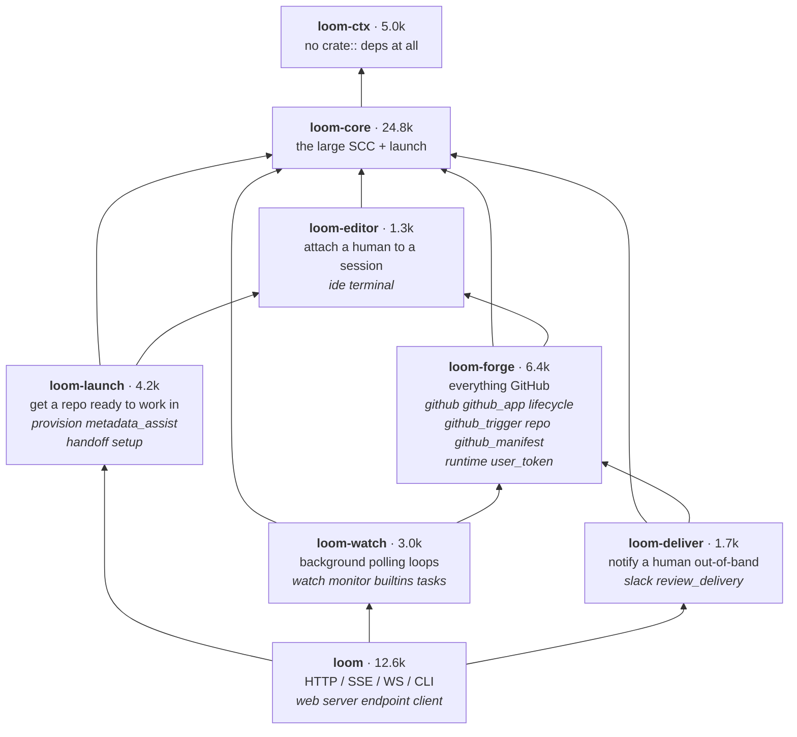

# Crate layering

How loom's code is partitioned into crates, why the partition is shaped the way
it is, and which module-level cycles still constrain it.

[ARCHITECTURE.md](ARCHITECTURE.md) is the map of what each module does. This
file is about the *edges between them*.

## Why partition at all

`loom` was one crate of 63k lines — 77% of the workspace. rustc parallelises
across crates, not within one, so the tail of every build was a single core
grinding on a single crate: `cargo check --lib` on `loom` ran 14.4s at exactly
100% CPU. Linking was never the cost (`link_binary` is 0.39s of a 38.4s build).

The measured cost model across three crates in this workspace is roughly
`T ≈ 2.0s + 0.20ms/line`, so splitting a 63k-line crate into pieces that build
concurrently is the only lever that moves the number.

## Current state

Four crates, stacked. Each re-exports the one below with `pub use`, so
`loom::session`, `loom::AppState` and friends name the same items regardless of
which crate defines them — call sites did not move when the code did.

| crate | mods | lines | contents |
|---|---|---|---|
| `loom-ctx` | 11 | 4,972 | `changes` `runner` `scratch` `loom_config` `client_context` `backend` `logs` `launch_gate` `envfile` `links` `ctx` |
| `loom-domain` | 22 | 24,129 | `acp` `agent` `profile` `session` `mcp` `session_layout` `auth` `chat` `channels` `db` `runs` `automation` `review_inbox` `chatlog` `custom_mcp` `history` `custom_agents` `status` `agent_env` `shell` `repo_env` `session_manager` |
| `loom-ops` | 21 | 17,320 | `watch` `provision` `github` `metadata_assist` `slack` `github_app` `lifecycle` `github_trigger` `handoff` `launch` `ide` `monitor` `terminal` `repo` `github_manifest` `review_delivery` `runtime` `setup` `builtins` `user_token` `tasks` |
| `loom` | 4 | 12,562 | `web` `server` `endpoint` `client` |

`loom-ctx` is defined by a property, not a topic: nothing in it references any
other loom module. It holds `Ctx` — `{ db, bus, addr }` — the ambient handle
that replaced threading `AppState` through every layer. `AppState` lives in
`loom-ops` and derefs to `Ctx`, so `st.db` and `&AppState` → `&Ctx` coercion
work unchanged at ~640 sites.

## The constraint

Tarjan over the 58-module `crate::` reference graph finds two strongly connected
components — sets of modules that mutually reference each other and therefore
cannot be placed in separate crates as-is:

```
[23,737 lines, 20 mods]  acp agent agent_env auth automation channels chat
                         chatlog custom_agents custom_mcp db history mcp
                         profile repo_env review_inbox runs session
                         session_layout status

[ 5,717 lines,  6 mods]  github github_app github_trigger lifecycle repo runtime

32 of 58 modules are independently placeable
```

Both survive stripping `#[cfg(test)]` blocks intact (17,710 and 4,398 production
lines), so the cycles are real code, not test fixtures.

`loom-domain` is the large SCC plus `shell` and `session_manager`. It is not a
bucket anyone chose — it is what remains entangled. `loom-ops` is the smaller
SCC plus 15 modules that merely sat above it.

## Where a new module goes

Ask in order, stop at the first yes:

1. **Does it reference any other `crate::` module?** No → `loom-ctx`.
2. **Is it in the large SCC** — does something in `session`/`agent`/`acp`/
   `profile`/`db`/`auth` reach back into it? Yes → `loom-domain`. This is a
   measured answer, not a judgement call.
3. **Otherwise** → `loom-ops`, unless it serves HTTP, in which case `loom`.

Step 3 is the weak one, and the reason `loom-ops` reads as a grab-bag: "reaches
outside the process" is an abstraction level, and abstraction levels do not tell
you where a *new* module belongs. Every candidate answer to step 3 is below.

## Target layering

### Splitting `loom-ops` by subject

This needs no cycle-breaking — it is a pure re-partition of `loom-ops`, and it
is already a DAG. Verified against the reference graph: **0 upward edges.**



`loom-core` is `loom-domain` + `launch`. Step 3 of the placement rule becomes:
GitHub → `loom-forge`; preparing a repo or worktree → `loom-launch`; attaching a
human to a live session → `loom-editor`; a polling loop → `loom-watch`;
notifying a human elsewhere → `loom-deliver`; serving HTTP → `loom`.

### Splitting the large SCC

The SCC is held together far more loosely than its size suggests. A
minimum-weight feedback arc set over the 20 modules — 52 edges, 158 production
call sites — is **22 call sites across 12 edges**. Cutting those yields a
9-level DAG:

```
L1  db
L2  session runs chat review_inbox custom_agents agent_env repo_env
L3  channels chatlog session_layout status
L4  acp history
L5  mcp
L6  agent
L7  profile
L8  automation custom_mcp
L9  auth
```

which groups into three crates with **0 upward edges** between them:

| crate | mods | prod lines | total lines |
|---|---|---|---|
| `loom-store` | `db` `session` `runs` `chat` `chatlog` `channels` `session_layout` `status` `review_inbox` `agent_env` `repo_env` `history` | 6,613 | 9,889 |
| `loom-agent` | `acp` `agent` `mcp` `custom_agents` | 7,482 | 9,173 |
| `loom-policy` | `profile` `auth` `automation` `custom_mcp` | 3,615 | 4,675 |

The stack reads as policy over mechanism: `auth` and `automation` decide,
`profile` configures, `agent`/`acp`/`mcp` execute, `store` persists.

## The 12 cuts

Grouped by the technique that resolves them.

### Misplaced constant or type — 6 edges, 10 sites

The item is used by a lower layer but defined in a higher one. `pub use`
re-export means relocating an item does not touch its call sites, so these are
near-free.

| site | item | move to |
|---|---|---|
| `acp/mod.rs:3185` | `agent::auto_approves_permissions` | shared agent-kind data |
| `agent.rs:782` | `auth::local_token_path` | `loom-ctx` (a path helper) |
| `chatlog.rs:75` | `agent::builtin_agent_type` | shared agent-kind data |
| `session.rs:265` | `agent::DEFAULT_ACP_MODE` | shared constants |
| `session.rs:264` | `profile::DEFAULT_PROFILE` | shared constants |
| `agent.rs:1265,1522,1626,1703,1718` | `profile::{Profile, allowed_tool_name, env_pairs, cleared_environment}` | `loom-store` (the `Profile` record) |

### Init-time inversion — 2 edges, 4 sites

The storage layer reaching up into domain logic during startup. `db::migrate`
should not know which tables need seeding; the composition root should call
these after `migrate` returns.

| site | item |
|---|---|
| `db.rs:142-144` | `profile::{backfill_mcp_policies, normalize_default, seed_stock_profiles}` |
| `db.rs:145` | `runs::reconcile_missing_sessions` |

### Relocating helpers — 4 edges, 8 sites

| site | item |
|---|---|
| `session.rs:363`, `session.rs:1069` | `session_layout::{insert_default_placement_tx, bump_revision_tx}` |
| `session.rs:364` | `channels::insert_session_channel_tx` |
| `mcp/mod.rs:117,160,161,211` | `custom_mcp::{list, ready_snapshots, permission_rule}` |
| `profile.rs:281` | `custom_mcp::list` |

## On traits

Traits break a dependency cycle through inversion: the lower crate declares the
trait, the upper crate implements it. That works when the coupling is *behavior
invoked at runtime across the boundary*, and it costs `dyn` dispatch or generic
parameters threaded through signatures.

None of the 12 cuts above is that shape.

- 10 of the 22 sites are a type or a constant. A trait cannot abstract away
  `struct Profile` or a `&'static str` — the type still has to live somewhere
  shared, so relocating it *is* the fix.
- 4 sites are startup calls, better resolved by moving the call to the caller
  than by handing `db` a trait object it invokes during migration.
- 8 sites are helpers sitting one module away from where they are used.

The one genuine inversion candidate is `acp::prompt_once`, which `agent` calls
in 12 places along with the `AcpPromptModel`/`AcpPromptEffort` selector enums.
Making `agent` depend on an abstraction there would let it sit *below* `acp` —
but the reverse edge is a single site (`acp/mod.rs:3185`), so cutting that and
leaving `agent` above `acp` is an order of magnitude cheaper.

The Rust feature doing the real work in this refactor is the unglamorous one:
`pub use` re-export, which makes moving an item between crates invisible to
every call site.

## Reproducing the analysis

The numbers above come from parsing `crate::<mod>::<item>` references (including
`use crate::<mod>::{A, B}` groups) out of `crates/loom*/src/**.rs`, keyed by
top-level module, with `#[cfg(test)]` blocks removed by brace matching. SCCs are
Tarjan; the feedback arc set is simulated annealing over the linear arrangement,
60 restarts.
