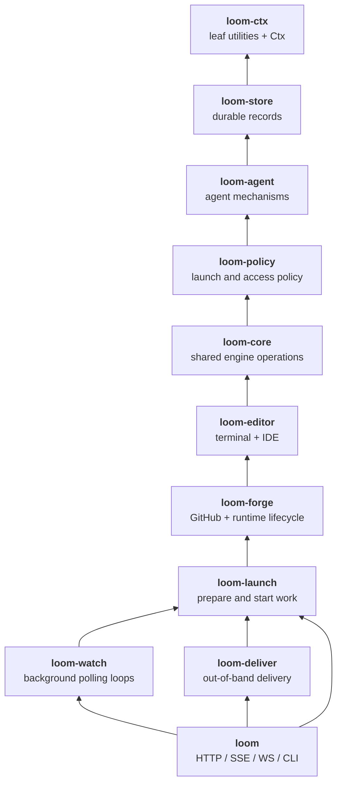

# Crate layering

How Loom's code is partitioned into crates, why the partition is shaped the way
it is, and where new modules belong.

[ARCHITECTURE.md](ARCHITECTURE.md) maps what each module does. This file is
about the *edges between them*.

## Why partition at all

`loom` was one crate of 63k lines — 77% of the workspace. rustc parallelises
across crates, not within one, so the tail of every build was a single core
grinding on a single crate: `cargo check --lib` on `loom` ran 14.4s at exactly
100% CPU. Linking was never the cost (`link_binary` was 0.39s of a 38.4s
build).

The measured cost model across three crates in this workspace was roughly
`T ≈ 2.0s + 0.20ms/line`. Splitting the 63k-line crate into independently
checkable pieces is the lever that moves that number.

## Current state

The engine is split into ten crates below the HTTP/CLI adapter. Every layer
re-exports the public modules below it, and `loom` re-exports every subject
crate, so `loom::session`, `loom::AppState`, and the rest keep their stable
public paths.

| crate | Rust files | lines | contents |
|---|---:|---:|---|
| `loom-ctx` | 14 | 5,024 | leaf utilities, shared agent constants and paths, and `Ctx` |
| `loom-store` | 14 | 10,111 | durable sessions, chat, channels, layout, status, runs, history, and profile records |
| `loom-agent` | 9 | 9,411 | ACP, agent runtimes, trusted MCP adapters, and custom-agent records |
| `loom-policy` | 6 | 4,362 | profiles, auth, automation, custom-MCP administration, and database initialization |
| `loom-core` | 4 | 1,107 | launch resolution, shells, and detached-session ownership reconciliation |
| `loom-editor` | 3 | 1,318 | terminal and embedded-editor attachment |
| `loom-forge` | 9 | 6,501 | GitHub, repository registration, runtime lifecycle, and `AppState` |
| `loom-launch` | 5 | 4,202 | provisioning, setup, metadata assistance, and handoff |
| `loom-watch` | 5 | 3,047 | monitor, watch scheduler, builtin programs, and maintenance tasks |
| `loom-deliver` | 3 | 1,692 | Slack and submitted-review delivery |
| `loom` | 31 | 18,350 | HTTP, SSE, WebSocket, CLI, and the frontend build |

`loom-ctx` is defined by a property, not a topic: nothing in it references
another Loom crate. It holds `Ctx` — `{ db, bus, addr }` — the ambient durable
handle every layer reads.

`AppState` lives in `loom-forge`, the first layer that combines the ACP
registry, editor registry, GitHub trigger, and launch gates. Editor handlers
take the narrower `EditorState`; Axum derives that state from `AppState`. Both
states dereference to `Ctx`, so ordinary `st.db` and `st.bus` call sites remain
unchanged without creating a dependency from the editor crate back to the
forge crate.

## Dependency graph

The production graph is a DAG. Arrows point from a crate to the layer it uses.
`loom` names every engine crate directly in its manifest for stable public
re-exports; the diagram shows the meaningful subject dependencies.



`loom-launch` depends on `loom-forge` because provisioning may fetch GitHub
issue context and applies the forge-owned runtime environment. `loom-watch` and
`loom-deliver` depend on `loom-launch` because both may create sessions. Those
real call edges are preferable to hiding the coupling behind a composition
trait, and they remain one-way.

## Where a new module goes

Ask in order and stop at the first match:

1. No Loom dependency at all, or a constant/path helper shared by every layer
   → `loom-ctx`.
2. Durable records and storage mechanics → `loom-store`.
3. Agent protocols, runtimes, or trusted MCP execution → `loom-agent`.
4. Profiles, authentication, automation policy, or operator-authored MCP
   policy → `loom-policy`.
5. A shared engine operation that does not need a live editor or GitHub
   integration → `loom-core`.
6. Attaching a human to a live session → `loom-editor`.
7. GitHub, registered repositories, credentials, or runtime lifecycle
   → `loom-forge`.
8. Preparing a repository/worktree or starting/replacing a session
   → `loom-launch`.
9. A background polling loop → `loom-watch`.
10. Notifying a human elsewhere → `loom-deliver`.
11. Serving HTTP, SSE, WebSockets, or the operator CLI → `loom`.

If a proposed module needs crates both above and below its subject, split the
data/mechanism from the policy or orchestration. Do not add an upward Cargo
edge.

## How the old cycles were cut

Before this split, Tarjan over the 58-module `crate::` reference graph found two
strongly connected components:

```
[23,737 lines, 20 mods]  acp agent agent_env auth automation channels chat
                         chatlog custom_agents custom_mcp db history mcp
                         profile repo_env review_inbox runs session
                         session_layout status

[ 5,717 lines,  6 mods]  github github_app github_trigger lifecycle repo runtime
```

Both survived stripping `#[cfg(test)]` blocks (17,710 and 4,398 production
lines), so they were real code cycles rather than fixture coupling.

A minimum-weight feedback arc set over the large component — 52 edges and 158
production call sites — was 22 call sites across 12 edges. Cutting them yielded
this module-level DAG:

```
L1  db
L2  session runs chat review_inbox custom_agents agent_env repo_env
L3  channels chatlog session_layout status
L4  acp history
L5  mcp
L6  agent
L7  profile
L8  automation custom_mcp
L9  auth
```

The cuts grouped naturally into three techniques.

### Relocate shared constants and records

| old dependency | item | owner now |
|---|---|---|
| `acp → agent` | `auto_approves_permissions` | `loom-ctx::agent_kind` |
| `agent → auth` | `local_token_path` | `loom-ctx::paths` |
| `chatlog → agent` | builtin-agent recognition | `loom-ctx::agent_kind` |
| `session → agent/profile` | default ACP mode and profile | `loom-ctx::agent_kind` |
| `agent → profile` | `Profile`, allowed-tool parsing, environment resolution | `loom-store::profile_data` |

The policy-facing `profile` module re-exports the lower record and helpers, so
public callers did not move.

### Invert database initialization

`loom-store::db` now applies only storage migrations and storage-owned
bootstrap work. `loom-policy::db` is the composition root: after migration it
runs profile MCP backfill/default normalization/stock-profile seeding and
reconciles interrupted automation runs. Storage no longer calls upward into
profile policy during migration.

### Put transaction helpers with the transaction owner

Session insertion owns its initial layout placement, layout revision bump, and
default channel/subscription writes. The layout and channel modules own later
user-driven mutations. Trusted MCP owns the custom-MCP read/snapshot/rule
helpers used to resolve a policy; `custom_mcp` re-exports those helpers for its
administrative API.

## Why not traits

Traits break a cycle when lower-level code invokes upper-level behavior at
runtime, at the cost of dynamic dispatch or generic parameters threaded
through signatures. None of these cuts had that shape:

- constants and records still need one concrete shared owner;
- startup calls belong at the composition root;
- transaction and query helpers belong beside the invariant they maintain.

The one genuine inversion candidate was `acp::prompt_once`, which `agent` calls
along with its model/effort selectors. Keeping `agent` above `acp` cost one
shared permission-mode helper; abstracting twelve prompt calls would have cost
far more.

The Rust feature doing most of the work is the unglamorous one: `pub use`
re-export. It makes moving an item between crates invisible to public call
sites while Cargo enforces the new dependency direction.

## Reproducing the analysis

The historical numbers above came from parsing `crate::<mod>::<item>`
references (including grouped `use` statements) out of
`crates/loom*/src/**.rs`, keyed by top-level module, with `#[cfg(test)]` blocks
removed by brace matching. SCCs are Tarjan; the feedback arc set used simulated
annealing over the linear arrangement with 60 restarts.
