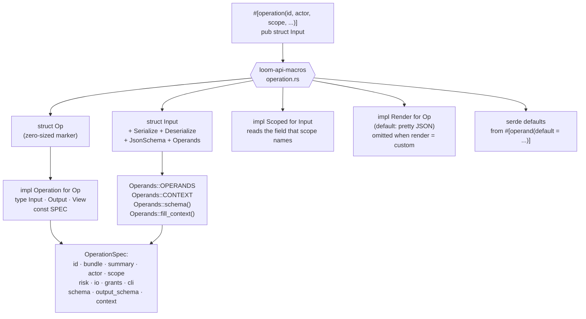
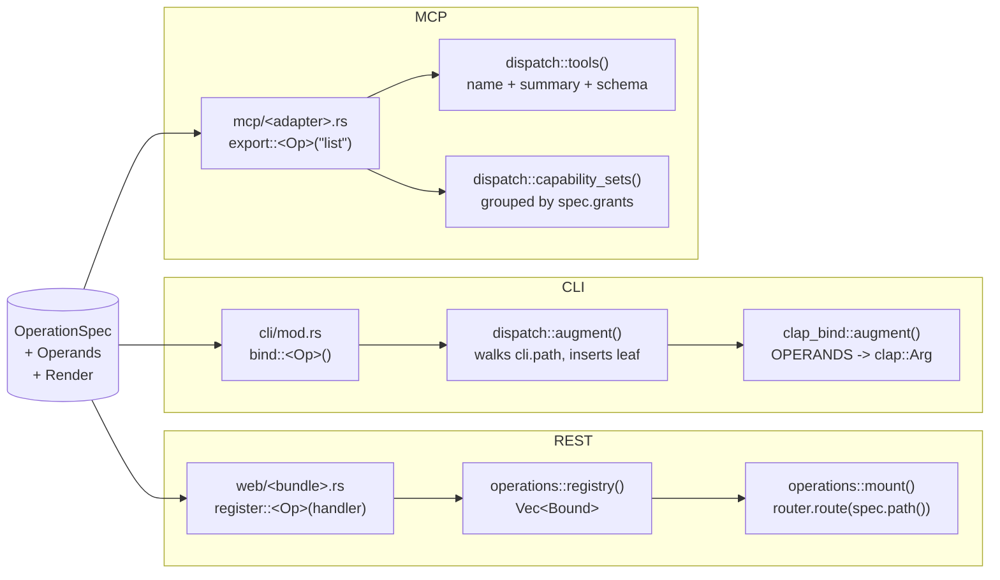
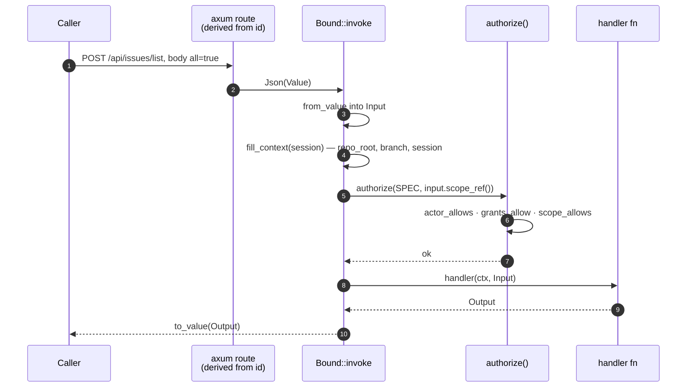
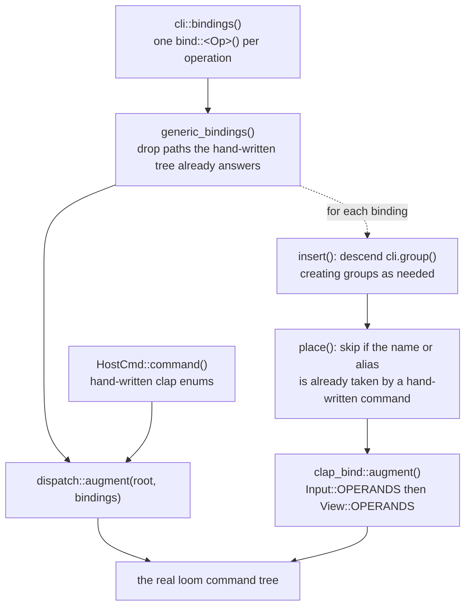
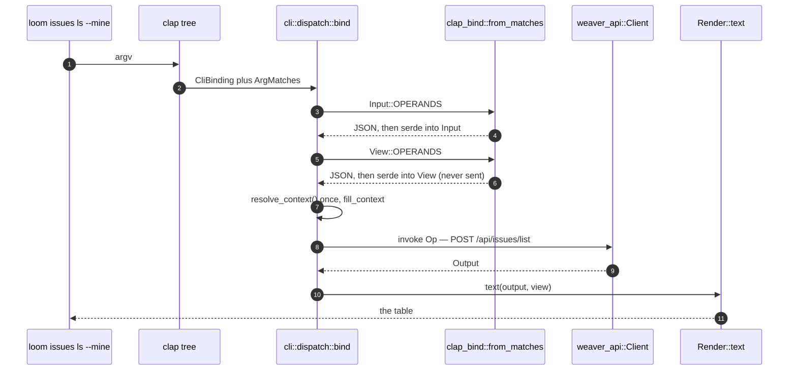
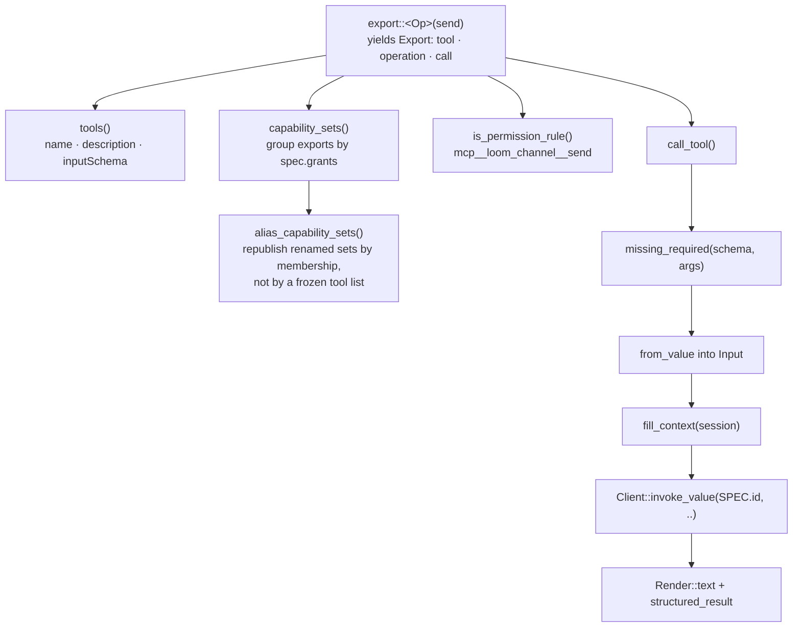
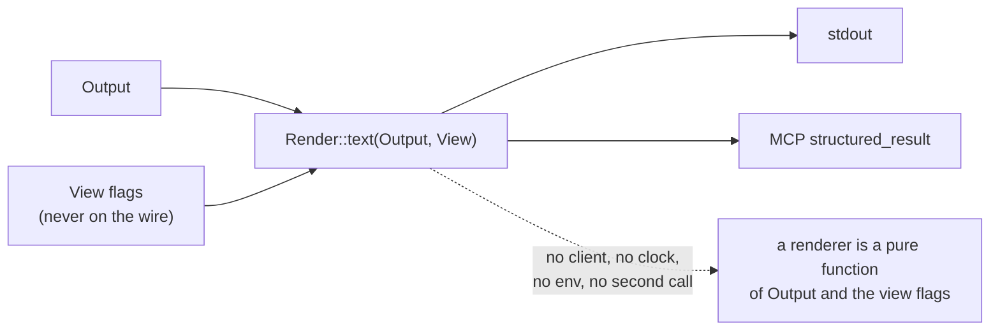
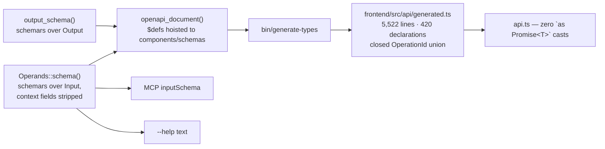

# How one declaration becomes three surfaces

The premise: **an operation is declared once, and REST, the CLI and MCP are
derived from that declaration.** Nothing about an operation is written down
twice, so no two surfaces can disagree about it.

This is the code flow end to end. Counts below come from
[`crates/weaver-api/tests/surface.txt`](../crates/weaver-api/tests/surface.txt),
the generated catalogue a test pins — treat it as the source of truth, not this
page.

## 1. The declaration

One attribute on the operation's `Input` struct. That is the whole authored
artifact; everything below is derived from it.

```rust
// crates/weaver-api/src/operations/issues.rs
pub mod list {
    use super::prelude::*;

    /// List current-session and repository work items.
    #[operation(id = "issues.list", actor = SessionSelf, scope = Repository, risk = Read,
                grants = ["loom/issues/read@v1"], cli = "issues list", cli_alias = "ls",
                view = View, render = custom)]
    pub struct Input {
        #[operand(context)]
        pub repo_root: String,
        /// Include closed work items.
        #[operand(default = false)]
        pub all: bool,
    }

    pub type Output = Vec<IssueView>;

    /// Presentation flags. These never cross the wire.
    #[derive(Debug, Clone, Default, Deserialize, View)]
    pub struct View {
        pub mine: bool,
    }
}
```

Each attribute key answers exactly one question, and each is read by a
different consumer:

| key | what reads it |
|---|---|
| `id` | the REST route (`POST /api/issues/list`), the MCP tool schema, the module path on disk |
| `actor` | `authorize()` — which credentials may call it |
| `scope` | `authorize()` — which resource it is checked against; also derives the `Scoped` impl |
| `risk` | audit + the permission model |
| `grants` | MCP capability sets, assembled by grouping exports by grant |
| `cli` / `cli_alias` | where it sits in the `loom` command tree |
| `io` | which dispatcher serves it (`Json` is the default and covers 200 of 214) |
| `view` | the presentation-flag struct, if it has one |
| `render` | `custom` means a hand-written `Render` impl; the default is the output's own JSON |

## 2. What the macro emits

`#[operation]` owns the struct: it rewrites it with the derives, then emits a
zero-sized marker type carrying the `OperationSpec`.



Two emitted pieces do the real work downstream.

**`OperationSpec`** is the transport-facing description. Note what it does
*not* contain: no method, no path, no argument list, no command string. The
route is computed from `id` (`OperationSpec::path()` at
`registry.rs:378`), and the arguments are read from the input type.

**`Operands::OPERANDS`** is the argument list as plain data — one `Operand`
per field:

```rust
pub struct Operand {
    pub name: &'static str,
    pub kind: OperandKind,      // Bool | Int | Str | OptBool | OptInt | OptStr | VecStr | VecInt | Json
    pub help: Option<&'static str>,
    pub required: bool,
    pub context: bool,          // dispatcher-supplied, hidden from callers
    pub default: Option<fn() -> Value>,
    pub cli: Option<CliSpelling>,   // positional | long | short | from_file
}
```

This is the piece that made `weaver-api` clap-free. It used to be two
generated methods per operand struct — `augment(clap::Command)` and
`from_matches(&ArgMatches)` — which meant the server, the Python binding and
every embedder linked a command-line parser merely to *describe* an operation.

## 3. The three doors



Each door costs **one line per operation** and no more. `bind::<Op>()`,
`export::<Op>("name")` and `register::<Op>(handler)` are generic over the
operation's own types, so the closure they produce cannot disagree with the
descriptor sitting beside it.

### REST

`register::<O>(handler)` (`web/operations.rs:56`) is the only place JSON
erasure happens. The type parameters are the check: a handler cannot accept or
return something the declaration does not promise.



`mount()` (`web/operations.rs:315`) walks `registry()` and calls
`router.route(spec.path(), post(..))` for each. **There is no second router
table.** Adding a registration creates its route.

The route is `/api/` + the id with dots as slashes, so `issues.tags.set` is
always `POST /api/issues/tags/set`. Nobody writes it down, so it cannot drift.

### CLI

The command tree is built from the registry and then merged into the
hand-written tree — not the other way around.



`clap_bind.rs` is the whole of Loom's clap knowledge — 252 lines, written
once, driven by data:

| `OperandKind` | clap shape |
|---|---|
| `Bool` | `ArgAction::SetTrue` |
| `OptBool` | tri-state: `--submit`, `--submit=false`, or absent |
| `VecStr` / `VecInt` | `ArgAction::Append`, `num_args(0..)` when positional |
| everything else | `ArgAction::Set` with an `i64` or `String` parser |

`from_matches` reads the parse back out as **JSON**, not as the struct.
Building the struct field by field would need each field's type at compile
time — which is exactly what forced the generated code. Going through JSON
means one runtime function serves all 214 operations, and a malformed value is
reported by `serde`, in the same place REST and MCP report it.



The dispatcher prints exactly what the renderer returned; the only thing it
adds is a final newline. (It used to `trim_end()`, which silently truncated
`loom artifacts get plan > plan.md`.)

### MCP

An adapter names the operations it exports. That list is the *only* place a
tool name and an operation are tied together — and the catalogue, the
capability sets, the permission rules and the code that runs a call are all
read off it, so a tool cannot be advertised without being served or served
without being advertised.

```rust
// crates/loom-agent/src/mcp/channel.rs
export::<channels::list::Op>("list"),
export::<channels::messages::create::Op>("send"),
export::<channels::wait::Op>("wait"),
```



Two compile-time assertions run where the export list is written
(`mcp/dispatch.rs:58`), so exporting a human-only or streaming operation is a
**build error**, not a runtime surprise:

```rust
assert!(Self::SPEC.actor.agent_reachable(), "an MCP tool must name an agent-reachable operation");
assert!(Self::SPEC.io.is_json(), "an MCP tool must name a JSON operation");
```

## 4. Presentation is derived too

`Render` is how an operation's result becomes text. **The CLI and MCP call the
same impl**, so one operation prints one way on both.



The default impl is the output's own pretty JSON, which is honest and complete
for the long tail of administrative commands — so a newly declared operation
has a working CLI immediately. 50 operations say `render = custom` and write
an impl in `crates/weaver-api/src/render/`.

**Purity is the rule that decides what can be declared at all.** A command
whose text needs a second read cannot be a renderer, and stays hand-written
with the reason recorded beside it:

- `loom summary` — `SessionCatchupView` lacks the `github` tag, the last three
  channel messages, and open threads per artifact; and reading the catch-up
  *writes*, advancing the agent's read marker.
- `loom issues ls` — polls the branch working each delegated issue for live
  status.
- `loom watch programs --source X` — a lookup that can miss, and `text()`
  returns a `String` with no way to say "no such program".

## 5. The fourth output: schemas

The same `schema` / `output_schema` function pointers that feed MCP also
generate the OpenAPI document and, from it, the frontend's types.



`strip_context_fields` removes `repo_root` / `branch` / `session` from the
caller-facing schema. The fields stay on the wire — the server still receives
them — they simply are not something a caller may supply. **An agent says "my
session" by saying nothing.** An explicit value still wins, and still faces the
scope check.

## 6. What holds it together

The registry is only trustworthy because these fail the build or the test
suite, not production:

| invariant | where | what it catches |
|---|---|---|
| `assert_registry_is_complete` | boot | a declaration with no handler, or a handler with no declaration |
| `surface_parity.rs` | test | a hand-mounted `.route(` that is not one of the 19 declared exceptions |
| `every_advertised_invocation_parses` | test | a `cli =` string that names a command the tree does not build |
| `every_generic_binding_dispatches_to_its_operation` | test | a command that parses but whose invocation is intercepted (this is the one that names all 18 unreachable commands when the dispatch fix is reverted) |
| `every_binding_names_an_operation_with_a_command` | test | the converse — a binding for an operation with no CLI |
| `Exportable::CHECKED` | compile | an MCP tool naming a human-only or non-JSON operation |
| `surface.txt` golden | test | any change to the operation table, reviewed as a diff |
| `builtin_capability_digests_are_stable` | test | a silent change to what a pinned capability set grants |

## Where the code lives

| path | what |
|---|---|
| `crates/loom-api-macros/` | `#[operation]`, `Operands`, `View` — 3 files |
| `crates/weaver-api/src/operations/registry.rs` | `OperationSpec`, `Operands`, `Render`, `Scoped`, `Io`, `Operand` |
| `crates/weaver-api/src/operations/*.rs` | the 214 declarations, one file per bundle |
| `crates/weaver-api/src/render/` | 10 files, 918 lines, 50 operations |
| `crates/loom/src/web/operations.rs` | `register`, `authorize`, `registry`, `mount` |
| `crates/loom/src/web/encodings.rs` | the 11 non-JSON `io` handlers, same `authorize` |
| `crates/loom/src/cli/clap_bind.rs` | all of Loom's clap knowledge, 252 lines |
| `crates/loom/src/cli/dispatch.rs` | `bind`, `augment`, `resolve` |
| `crates/loom/src/cli/mod.rs` | `bindings()` — one line per operation |
| `crates/loom-agent/src/mcp/dispatch.rs` | `export`, `call_tool`, `capability_sets` |
| `crates/loom/src/bin/loom.rs` | the clap tree and its tests, 1,326 lines, nothing else |

## The shape in one sentence

An id, an actor, a scope and an argument struct; the route is the id, the
command is a string in the same attribute, the tool is one line in an adapter,
the schema is `schemars` over the same struct, and the text is one `Render`
impl the CLI and MCP both call.
