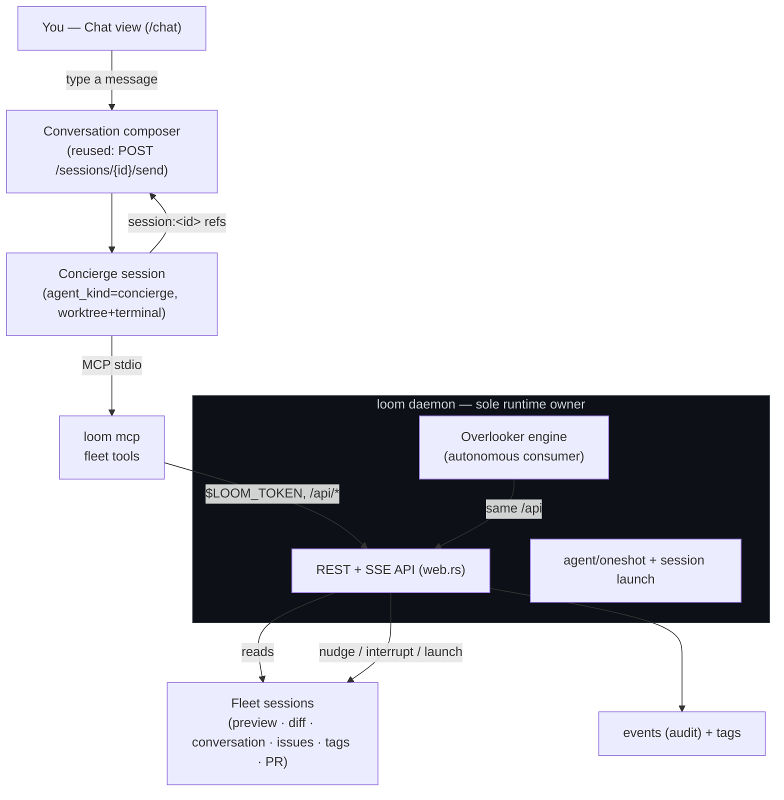

# The Concierge — a conversational meta-layer over the fleet

A weaver [plan](../structured-projects.md) (weaver issue #280): the design
surface for a **Chat** layer that lets you *talk to an agent about the other
sessions*. This file owns the *structure* — the problem, the architecture, the
tasks and their dependencies; the issue ledger owns the *state*. Nothing here
ships yet — it is the design of record to build against. The [Tasks](#tasks)
materialise into weaver issues when the design is agreed.

## Problem & goal

You launch a handful of sessions over a morning, wander off, and come back to a
wall of cards. You *can* read the fleet — every session's screen, diff,
conversation, PR, and tags are one REST call away — but the only thing that
turns that raw state into an answer is **you**, clicking through tabs. The
questions you actually have are in plain language:

- *"Are there any stale sessions I should know about?"*
- *"Which of these need me, and why?"*
- *"What did the auth-refactor session actually change?"*
- *"Spin up a session to fix the flaky e2e test, and tell me when it's done."*

[The overlooker](overlooker.md) answers the *push* half of this: it wakes on a
timer, surveys the fleet, and stamps a `triage` mark on what looks stuck. But an
overlooker can't be *asked*. It runs a fixed program on a schedule; it can't
hold a conversation, follow a hunch, or do the one-off investigation you only
thought of just now. The missing primitive is the **pull** half: an agent that
**holds the whole fleet in its head**, that you **converse with on demand**, and
that can **act on your behalf** — read a session and summarise it, point you
straight at the one that needs you, nudge a stuck one, or launch a new workstream
and watch it for you.

The goal: a **Chat** surface — a top-level view, sibling to the session list —
backed by a fleet-aware agent that is *auto-hooked into loom* the moment it
starts, so you can ask about the floor and have it answer, link, and act.

## The insight: the overlooker's conversational twin

The overlooker design already did the hard architectural thinking, and it lands
on the exact seam this feature needs:

> Everything loom can do is a REST route; an out-of-process agent reaches the
> fleet only through that API, with a **capability-gated** client over it and a
> **bounded, audited intervention ladder** (observe → mark → nudge → interrupt →
> launch). The daemon stays the single owner of the live runtime.

That is *already built*: `python/weaver-loom` is a capability-gated `Client` over
the REST API; `POST /api/agent/oneshot` is the env-stripped headless-agent
primitive; the overlooker engine is the autonomous consumer of it.

So the concierge is **not a new subsystem — it is a second front-end on the same
substrate.** Two ways to drive one fleet API:

| | **Watch** (overlooker) | **Chat** (concierge) |
|---|---|---|
| Trigger | a cron tick or a fleet event | a message you type |
| Cadence | autonomous, scheduled | on-demand, interactive |
| Output | a `triage` mark on a branch | a reply in a conversation |
| Memory | per-round lookaside state | a running conversation |
| Reaches the fleet via | the bound REST API | the **same** bound REST API |
| Acts via | the capability ladder | the **same** capability ladder |

They are siblings in the nav rail (the rail already pairs them: **Watch** is an
eye over the looms; **Chat** is the conversation about them) and they *converge*:
the most natural way to *create* an overlooker — "ping me whenever a session goes
red" — is to **ask the concierge to draft one for you** (the overlooker plan
already calls for agent-authored overlookers via the CLI). Chat is how you reach
into the fleet right now; Watch is how you ask it to keep an eye out for you.
The concierge is the front door to both.

## The name

The mill metaphor runs through weaver — `loom`, `weaver`, `tapestry`, and the
**overlooker** who walks the rows and tends the looms. The conversational
companion plays a different role: the one who *knows where everything is*, points
you to what needs you, and runs an errand on your behalf. That is a
**concierge**. It is the working noun in the code and the API (`agent_kind =
"concierge"`); the UI surface is plainly labelled **Chat** (what the user does
there). ("The gaffer" — the Lancashire mill foreman you'd report to — is the
themed alternative if we'd rather keep the dialect; see
[Open questions](#open-questions).)

- A **concierge** is the fleet-aware chat agent.
- A **chat** is one conversation with it.
- The **fleet tools** are the MCP surface it reaches the fleet through.

## TL;DR

1. **A concierge is a session, not a new runtime.** It is a normal loom session
   of a new `agent_kind = "concierge"` — its own worktree, terminal supervisor,
   and lifecycle — so it reuses the **entire** session machinery: launch, the
   live terminal, orphan/adopt across a restart, and — the big win — the
   **already-drivable [Conversation tab](../ARCHITECTURE.md)**, whose composer
   sends a prompt straight into the agent and auto-refreshes on its turn edges.
   Chatting with the fleet is *turn-taking with an agent*, which loom already
   does.
2. **It reaches the fleet through an MCP server over the REST API — one seam,
   now four consumers.** A new `loom mcp` stdio server exposes the fleet as typed
   tools (`fleet_list`, `session_preview`, `session_conversation`,
   `session_diff`, `session_nudge`, `session_launch`, `session_link`, …), each a
   thin proxy to an existing `/api` route, authenticated by the machine-local
   `$LOOM_TOKEN` loom already injects. It is the same API the overlooker binding
   and the `loom` CLI wrap — typed tools just suit an agent better than parsing
   CLI text.
3. **Auto-hooked at launch.** Launching a concierge installs its `mcpServers`
   block into `.claude/settings.local.json` (the same merge `install_hooks`
   already does for the status hooks), injects `$LOOM_TOKEN`, grants its
   capability set, and seeds a **`CONCIERGE.md` primer** — the analogue of
   `WEAVER.md` — full of *tips*: how to glance at a session fast (`preview`),
   read it deep (`conversation`), judge staleness (`last_activity_at` + the
   `idle`/`attention` tags), and link to it. It boots already knowing the fleet.
4. **It produces links you can click.** The concierge answers with live
   **`session:<id>` references** that the conversation renderer projects into
   status chips linking to `/s/<id>` — the smartdoc `#41`-issue-chip machinery,
   pointed at sessions. "Look into `session:ab12`" becomes a click.
5. **It acts on your behalf, on the bounded ladder, with you in the loop.**
   `observe`/`link` are always on; `nudge`, `interrupt`, and `launch` are
   capability-gated and — because a human is *right there in the chat* — confirmed
   conversationally before they fire. Every action is an `events` row, exactly
   like an overlooker's.
6. **It never authors another actor's facts.** The agent owns its `attention`
   tag; the overlooker owns `triage`. The concierge **talks** — its findings live
   in the conversation, not as a third writer fighting over the same tag.

The rest argues each point.

## Architecture

The concierge is just another out-of-process consumer of the REST API — like the
overlooker binding and the `loom` CLI — wrapped this time as MCP tools and driven
by a conversation instead of a cron tick.

## The fleet tool surface: an MCP server over the REST API

The user asked for "MCP or readmes for an agent to understand how to explore
loom." Both have a place, but they sit at different layers:

- **MCP is the primary surface.** An agent reasons over *typed, structured* tool
  results far better than over scraped CLI text. The fleet is already fully
  described by the REST API and `frontend/types.ts`; an MCP server is the
  thinnest possible adapter that turns each route into a tool. New `loom mcp`
  subcommand: a stdio MCP server that proxies to `$WEAVER_API` with the
  machine-local token. It holds no state the API doesn't — same discipline as
  `weaver_loom`.
- **The CLI is the always-available fallback.** A concierge session has `loom`
  and `weaver` on `PATH`, so `loom session preview <id>`, `weaver issue ls`, and
  friends still work for anything the MCP doesn't cover — "the CLI *is* the API
  mirror," as the overlooker plan puts it.
- **The primer is the tips.** `CONCIERGE.md` (below) is the "readme" — not an
  API reference (the tools are self-describing) but *judgement*: which tool to
  reach for, and how to read what it returns.

The tool set maps one-to-one onto routes that already exist (so the MCP is
implementation, not new API):

| MCP tool | Route today | Capability |
|---|---|---|
| `fleet_list` (filter: attention / idle / repo / lifecycle) | `GET /api/sessions` | observe |
| `session_get` | `GET /api/sessions/{id}` | observe |
| `session_preview` (fast screen glance) | `GET /api/sessions/{id}/preview?lines=N` | observe |
| `session_conversation` (deep read / summary) | `GET /api/sessions/{id}/conversation` | observe |
| `session_diff` (what it changed) | `GET /api/sessions/{id}/diff` | observe |
| `session_issues` / `fleet_issues` | `GET /api/branches/{id}/issues`, `GET /api/issues` | observe |
| `session_link` (canonical `session:<id>` ref + `/s/<id>` URL) | pure | observe |
| `session_nudge` | `POST /api/sessions/{id}/send` | **nudge** |
| `session_interrupt` | `POST /api/sessions/{id}/interrupt` | **interrupt** |
| `session_launch` (returns the tracking issue) | `POST /api/sessions` | **launch** |
| `overlooker_draft` / `_dry_run` / `_register` | `…/overlookers` + `{dry_run}` | **launch** |

The capability column is enforced **in the MCP server**, the same place
`weaver_loom._gate` enforces it — a concierge granted only `observe`+`nudge`
cannot launch, no matter what the model asks.

## The concierge as a session kind

A new `agent_kind = "concierge"` rides the existing launch path
(`agent::launch`, the `sessions` table, `launch_script`), with three deltas at
launch time, all on seams that already exist:

1. **Install the MCP.** Extend the hook-install step (`install_hooks` already
   merges into `.claude/settings.local.json`) to also merge an `mcpServers`
   entry: `loom mcp --base $WEAVER_API`. `$LOOM_TOKEN` is already injected into
   the session's subprocess env, so the server authenticates with zero config —
   even behind a reverse proxy with loopback trust off.
2. **Seed the primer.** The `CONCIERGE.md` doc is injected the way `WEAVER.md`
   is — through the `SessionStart` primer (`session_primer`) — so a fresh or
   resumed concierge always re-reads its role and tips.
3. **Grant capabilities.** The session row carries the concierge's capability set
   (default `observe`, `link`, `nudge`, `launch`; `interrupt` opt-in), which the
   MCP reads to gate its tools. Because a human confirms each action in the chat,
   the default is more permissive than an autonomous overlooker's — but the
   ladder and the audit trail are identical.

Lifecycle reuse is the point: the concierge is **hidden from the fleet list**
(like the overlooker's warm session), **orphan/adopts across a loom restart**, and
its history *is* its conversation — already captured and rendered by the
Conversation tab.

**Singleton to start.** One persistent concierge ("the fleet chat") that the
**Chat** view opens, auto-created on first use. Matches the single-operator auth
scale and the user's "a new Chat tab which gives us an agent." Multiple named
chats (one per investigation) are a clean later extension — a chat is a session,
and loom already lists many.

### The primer (`CONCIERGE.md`) — the tips

The judgement an agent needs that the tools don't encode. Sketch:

- **Glance vs. deep-read.** `session_preview` (the live screen, cheap) is for a
  fast read of *what a session is doing right now*; `session_conversation` (the
  normalized log) is for *what it has done and decided* — use it to summarise.
  `session_diff` for the code; `branch.github` for PR/CI state.
- **Reading staleness.** A session is likely stale when it is `running` but
  carries the quiet `idle` tag and its `last_activity_at` is old, with no loud
  `attention`. "Needs me" is the loud `attention`/`triage` ladder. Don't confuse
  the two: idle is calm, attention is a call.
- **Always link.** Refer to a session as `session:<id>` so the user can click
  through; name the repo and branch so the reference is legible.
- **Be a concierge, not a cowboy.** Summarise and point first. Before you
  `nudge`/`interrupt`/`launch`, say what you'll do and why, and let the user
  confirm in the next turn. You have the whole fleet in view — the user has one
  question; bridge the two.

## The Chat surface (UI)

API-first ([[ui-built-on-rest-api]]), and mostly *assembly of parts that exist*:

- **A top-level rail entry, `Chat`** — sibling of Sessions / Issues / **Watch** /
  Shell (a `messages-square` glyph). Routes to `/chat`.
- **The view reuses `SessionConversation.vue` verbatim** — the skimmable iris-log
  renderer with the foot composer. The composer already POSTs to
  `/sessions/{id}/send` (type + Enter) and auto-refreshes on the agent's turn
  edges, so the chat round-trip is *already solved*; `/chat` just resolves (or
  creates) the singleton concierge session and mounts the component against it.
- **Linkified session references.** Teach the conversation's `MarkdownView` to
  project `session:<id>` into a live chip — title + lifecycle/attention dot,
  linking to `/s/<id>` — exactly as smartdoc renders a `#41` issue chip from the
  ledger. This is the one genuinely new bit of rendering, and it is the
  "produces links to a session" requirement.

## Producing links & acting on your behalf

Two tiers of action, both reusing existing primitives, both audited:

- **Nudge / interrupt an existing session.** `session_nudge` →
  `POST /sessions/{id}/send` types a message into a watched session's agent;
  `session_interrupt` → `POST /sessions/{id}/interrupt` stops its turn. "Tell the
  auth session to rebase on main" becomes one gated tool call, recorded as a
  `nudge` event with the concierge as author.
- **Launch a new workstream.** `session_launch` → `POST /api/sessions` forks a
  fresh session for work the user wants done, and returns its **tracking issue**.
  The concierge can then watch it (`weaver issue wait` / `session_get`) and report
  back in a later turn — "the flaky-test fix is `session:cd34`; it opened a PR,
  CI is green."

The concierge **does not write the `triage` tag** — that is the overlooker's
fact, and two actors authoring one fact is the anti-pattern the overlooker plan
is built to avoid. Its findings live in the conversation. If a durable mark is
ever wanted, it writes its *own* typed key (loudness lives in the value, not the
key), never `attention` or `triage`.

## Capabilities & safety

The concierge inherits the overlooker's safety frame wholesale — it is the same
ladder over the same API:

- **The intervention ladder, enforced at the MCP boundary.** `observe`/`link`
  always on; `nudge`/`interrupt`/`launch` gated. A tool call past the granted set
  is refused before it hits the API.
- **Human-in-the-loop by construction.** Unlike an autonomous overlooker, every
  concierge action is bracketed by a user turn — it proposes, you confirm. That
  is what makes a more permissive default capability set safe.
- **No recursion.** A concierge's `fleet_list` excludes concierge and overlooker
  sessions; it cannot act on a watcher. Watchers don't watch watchers, and the
  concierge doesn't drive itself.
- **Everything is an event.** Every nudge, interrupt, and launch is an `events`
  row with the concierge as author — the same audit trail the overlooker round
  history renders, visible on the touched session's activity.
- **Kill switches.** Archiving the concierge session tears it down like any
  other; a `concierge.enabled` (or reuse `overlooker.enabled`-style) setting gates
  the feature.

## Worked example: "any stale sessions I should know about?"

End to end, on the singleton concierge:

1. You open **Chat** and type the question. The composer sends it into the
   concierge session (reused `/send`); the Conversation tab will stream the reply.
2. The concierge calls `fleet_list` → `GET /api/sessions`. It filters to
   `running` sessions carrying the quiet `idle` tag with an old
   `last_activity_at` and no loud `attention` — its staleness heuristic from the
   primer.
3. For each candidate it calls `session_preview` (and `session_conversation` when
   it needs to know *why* it stalled — waiting on a prompt? wedged on a failing
   test?).
4. It replies in plain language with **clickable** references:
   > Two look stale. `session:ab12` (weaver / *auth-refactor*) finished its turn
   > 3 h ago waiting for review — its PR is green. `session:cd34` (loom /
   > *flaky-e2e*) has been re-running the same test for 40 min with no progress.
   > Want me to nudge cd34 to try a different approach, or leave it?
5. You reply "nudge it." The concierge calls `session_nudge` (gated by the
   `nudge` capability) → `POST /sessions/cd34/send`, recorded as a `nudge` event
   attributed to the concierge, and confirms.

No new survey engine, no new agent runtime, no new status axis — a conversation
over the API the fleet already exposes.

## Tasks

Each task has a stable id; `deps:` edges define the delivery sequence. They
materialise into weaver issues when the design is agreed (the overlooker plan's
convention). `T2`/`T3` are the only genuinely new runtime; the rest is assembly.

### C1 — `loom mcp`: the fleet tool server  `value: high`  `deps: —`
A stdio MCP server (new `loom mcp` subcommand) proxying the read routes
(`fleet_list`, `session_get/preview/conversation/diff/issues`, `session_link`) to
`$WEAVER_API` with `$LOOM_TOKEN`. Read-only first. Acceptance: an MCP client lists
the fleet and reads a session's conversation through the server.

### C2 — The `concierge` agent kind + auto-hook at launch  `value: high`  `deps: C1`
`agent_kind = "concierge"` on the launch path; extend `install_hooks` to also
merge the `mcpServers` block; seed the `CONCIERGE.md` primer via `session_primer`;
carry a capability set on the session row. Acceptance: launching a concierge yields
a session whose agent can call the fleet tools unprompted.

### C3 — `CONCIERGE.md` primer  `value: high`  `deps: —`
The tips doc (glance vs. deep-read, staleness heuristic, always-link, propose-then-
act), `include_str!`'d like `WEAVER.md`. Acceptance: a fresh concierge re-reads it
on `SessionStart`.

### C4 — The Chat view + singleton resolution  `value: high`  `deps: C2`
A `/chat` route + rail entry that resolves (or creates) the singleton concierge and
mounts `SessionConversation.vue` against it; the concierge hidden from the fleet
list. Acceptance: Chat opens a working conversation with the fleet agent.

### C5 — `session:<id>` linkified references  `value: med`  `deps: C4`
Project `session:<id>` into a live status chip linking to `/s/<id>` in the
conversation `MarkdownView` (the smartdoc `#41` machinery, for sessions); a
`session_link` tool returns the canonical ref. Acceptance: a concierge reply's
session references render as clickable chips.

### C6 — Action tools: nudge / interrupt / launch  `value: med`  `deps: C2`
The capability-gated mutating tools over `…/send`, `…/interrupt`, and
`POST /api/sessions`; each records an `events` row attributed to the concierge.
Acceptance: with the capability granted, the concierge nudges and launches; without
it, the tool is refused.

### C7 — Overlooker authoring from chat  `value: low`  `deps: C6, overlooker T8`
`overlooker_draft/dry_run/register` tools so "ping me whenever a PR goes red"
becomes a drafted, dry-run, registered overlooker. The Chat ⇄ Watch convergence.
Acceptance: the concierge scaffolds and dry-runs an overlooker against the live
fleet from a chat turn.

## Rollout

- **Phase 0 — Read-only concierge.** C1 (MCP reads), C3 (primer), C2 (kind +
  auto-hook), C4 (Chat view). First milestone: you can *ask about* the fleet and
  get linked, summarised answers. No mutation yet — safe by construction.
- **Phase 1 — Links & action.** C5 (clickable refs), C6 (nudge/interrupt/launch on
  the gated ladder). The concierge can now *act on your behalf*, with you
  confirming each step.
- **Phase 2 — Convergence.** C7 (author overlookers from chat). Chat becomes the
  front door to Watch.

## Non-goals

- **Not a new agent runtime.** A concierge is a session; it reuses launch, the
  terminal, orphan/adopt, and the drivable Conversation tab. We add a tool server
  and a primer, not a parallel agent loop.
- **Not a new status axis.** The concierge talks; it never writes `attention` or
  `triage`. Two actors never author one fact.
- **Not a second fleet API.** The MCP wraps the existing REST routes — one seam,
  one more consumer beside the overlooker binding and the `loom` CLI.
- **Not autonomous.** The concierge acts only inside a conversation, each action
  confirmed by a user turn. The autonomous watcher is the overlooker; this is its
  on-demand twin.
- **Not multi-tenant yet.** One singleton concierge at the single-operator scale;
  many named chats is a later, additive step.

## Open questions

- **Name.** `concierge`/`Chat` (clear) vs. the themed `gaffer` (the Lancashire
  mill foreman, matching `overlooker`'s dialect). Recommend `concierge` in the
  code, **Chat** in the UI; open to the themed noun.
- **Worktree-backed vs. lightweight chat.** A concierge-as-session gets a worktree
  it mostly doesn't use. The alternative — a bespoke `chats` table driven by a
  multi-turn variant of `agent/oneshot`, no worktree — is *lighter* but
  *reinvents* the conversation viewer, the composer, the terminal, and
  orphan/adopt. Recommend session-backed (maximal reuse, ships fastest); revisit if
  the empty worktree grates.
- **Staleness as a server signal.** The concierge computes staleness client-side
  from `last_activity_at` + tags. The overlooker plan (T7) also wants a synthetic
  `session.stale` event — if that lands, both consumers should share one
  definition rather than each rolling their own.
- **Singleton scope.** One concierge per machine, per operator, or per repo? Start
  global (single-operator scale); scope later if it earns its keep.
- **How permissive a default.** Because a human confirms each turn, is
  `launch`-by-default acceptable, or should the first cut ship `observe`+`nudge`
  only and make `launch` an explicit grant? Lean conservative for Phase 1.
