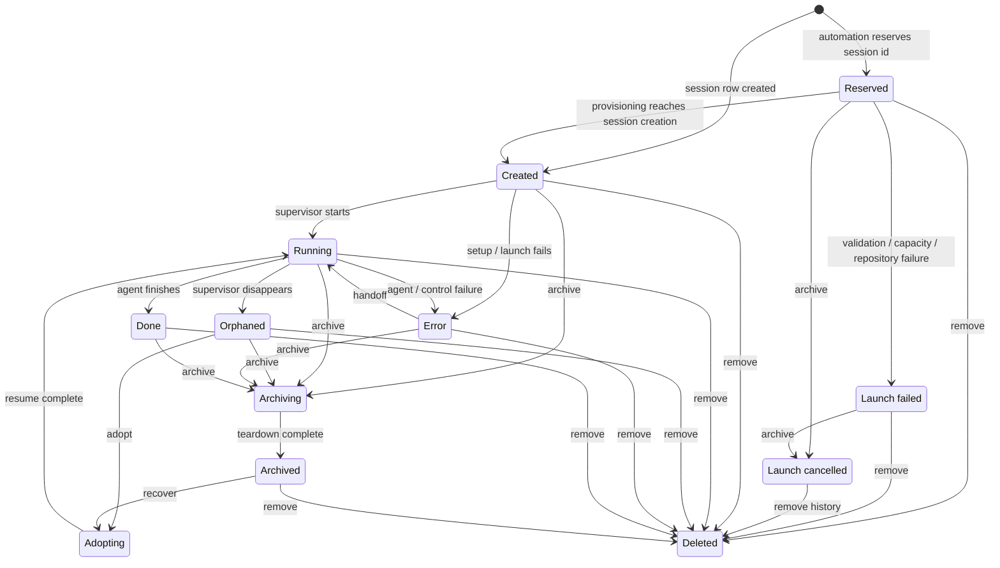
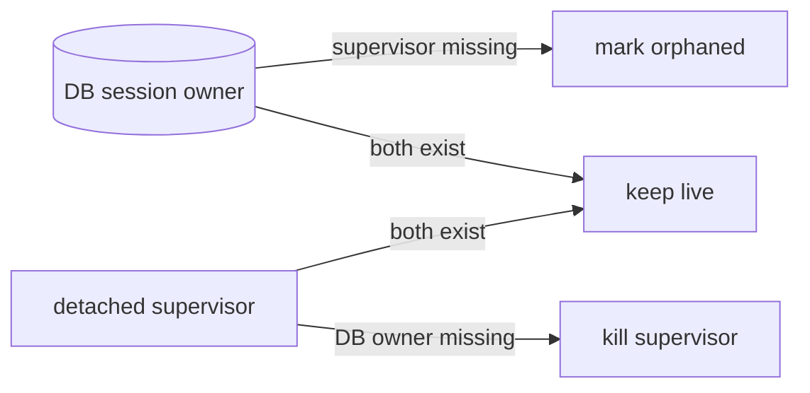

# Session lifecycle

Loom's database owns every agent runtime. A detached Tapestry supervisor may
outlive the `loom server run` process, but it may not outlive its durable owner.
Conversely, losing a supervisor does not erase its session record: Loom marks
the session orphaned so it can be adopted or archived.

Automation launch attempts have a short phase before a session exists. Their
`automation_runs` row reserves the future session id and remains visible when
validation, capacity, clone, or fetch fails. Archive and remove accept that
reserved id too, so an early failure is never an unactionable pseudo-session.
Retryable channel failures remain `waiting` with their latest launch error. A
redelivery clears that error when it claims a fresh provisioning attempt; the
dashboard's Clear action archives an attempt that should no longer be retried.

## State transitions



The session lifecycle is the mechanical `sessions.status` axis:
`created`, `running`, `orphaned`, `done`, `error`, or `archived`. It remains
separate from branch attention tags, which describe whether the agent needs a
person.

Long-running external mutations keep that last completed status and publish a
durable `transition` alongside it. Archive reports `archiving` with stages such
as conversation capture, agent shutdown, worktree removal, and finalization.
Adopt/recover report `adopting`, including worktree rebuild where recovery needs
one. Fleet and detail views show the transition and current free-text stage;
lifecycle actions and conversation input stay unavailable until it clears.
Competing operations serialize on the lifecycle lock and also claim the marker
atomically, so overlapping server generations cannot both mutate the same row.
On restart Loom resumes an interrupted archive/adoption or restores the last
recoverable stable state before ordinary supervisor reconciliation.

`automation_runs.status` describes delivery/provisioning rather than agent
liveness: `creating`, `waiting`, `delivering`, `running`, `failed`,
`cancelled`, or `completed`.

## Actions

- **Adopt** recreates a missing supervisor for an orphaned worktree. When the
  session already has a live ACP driver, adoption instead settles the row: a
  driver and an `orphaned` status cannot both be true, and the running agent is
  the authority.
- **Recover** recreates an archived worktree and resumes its agent.
- **Archive** tears down terminal, debug shells, editor, credentials, and
  worktree while keeping the session/attempt and branch history.
- **Remove** performs the same teardown and deletes the durable record. A
  session remove also deletes its branch unless `keep_branch=true`.

Archive and remove are accepted in every state. External teardown is
idempotent: a missing runtime or worktree means that part is already complete.
An automation cancellation is written before teardown, and the final
`creating -> running` promotion is conditional. If provisioning finishes after
cancellation, cancellation wins and Loom removes the late-created session.

Both actions use the same operation for full sessions and unmatched launch
attempts:

```text
POST /api/sessions/archive   { session }
POST /api/sessions/delete    { session }

loom sessions archive <session-or-reserved-id>
loom sessions rm <session-or-reserved-id>
```

## Ownership reconciliation

Loom periodically inventories Tapestry's live supervisors against the database:



- `weaver-<id>` belongs to an existing, non-archived session (including an
  inspectable `done`/`error` session) or an active automation reservation for
  `<id>`.
- `loom-shell-<id>-<index>` belongs to an existing, non-archived session.
- An unowned name in either namespace is torn down.
- `loom-scratch-shell` and names outside Loom's namespaces are untouched.

An ACP session has a second ownership axis inside that reconciliation: which
*driver* owns it. Tapestry's relay admits one subscriber, so attaching a new
driver evicts the previous one — including a driver belonging to an overlapping
restart generation, which no in-process registry can observe. Each driver
therefore claims `sessions.acp_driver_epoch` before it subscribes, and only the
holder of the current epoch may mark the session `orphaned`. An evicted driver
exits without touching the row, and the driver that replaced it clears any
`orphaned` status its predecessor raced in.

The first reconciliation runs before restart adoption; a background pass keeps
the invariant convergent after crashes and cancellation races. Active
reservations protect early provisioning during a rolling deployment, while
existing session rows protect every live agent that predates the new server.

There is no operation for listing engine-managed watch sessions directly; the
default fleet and survey exclude them unconditionally so a watch never surveys
its own infrastructure.
