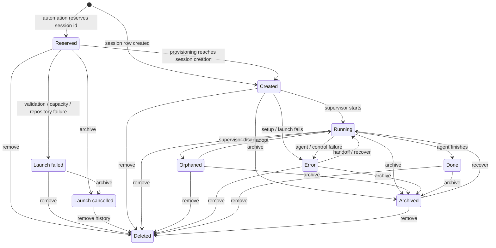
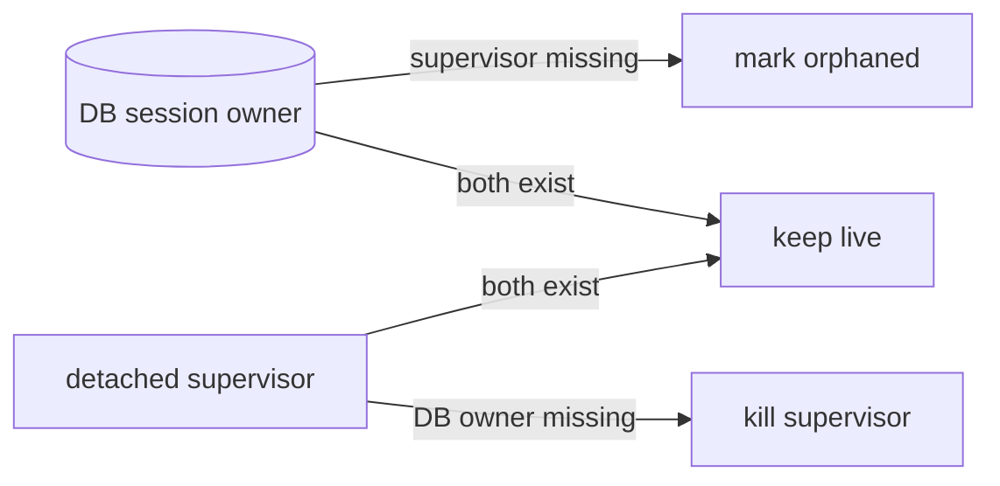

# Session lifecycle

Loom's database owns every agent runtime. A detached Tapestry supervisor may
outlive the `loom server run` process, but it may not outlive its durable owner.
Conversely, losing a supervisor does not erase its session record: Loom marks
the session orphaned so it can be adopted or archived.

Automation launch attempts have a short phase before a session exists. Their
`automation_runs` row reserves the future session id and remains visible when
validation, capacity, clone, or fetch fails. Archive and remove accept that
reserved id too, so an early failure is never an unactionable pseudo-session.

## State transitions



The session lifecycle is the mechanical `sessions.status` axis:
`created`, `running`, `orphaned`, `done`, `error`, or `archived`. It remains
separate from branch attention tags, which describe whether the agent needs a
person.

`automation_runs.status` describes delivery/provisioning rather than agent
liveness: `creating`, `waiting`, `delivering`, `running`, `failed`,
`cancelled`, or `completed`.

## Actions

- **Adopt** recreates a missing supervisor for an orphaned worktree.
- **Recover** recreates an archived worktree and resumes its agent.
- **Archive** tears down terminal, debug shells, editor, credentials, and
  worktree while keeping the session/attempt and branch history.
- **Remove** performs the same teardown and deletes the durable record. A
  session remove also deletes its branch unless `keep_branch=true`.

Archive and remove are accepted in every state. External teardown is
idempotent: a missing runtime or worktree means that part is already complete.
An automation cancellation is written before teardown, and the final
`creating -> running` promotion is conditional. If provisioning finishes after
cancellation, cancellation wins and Loom removes the late-created session.

Both actions use the same REST/CLI path for full sessions and unmatched launch
attempts:

```text
POST   /api/sessions/{session-or-reserved-id}/archive
DELETE /api/sessions/{session-or-reserved-id}

loom session archive <session-or-reserved-id>
loom session rm <session-or-reserved-id>
```

## Ownership reconciliation

Loom periodically inventories Tapestry's live supervisors against the database:



- `weaver-<id>` belongs to an existing, non-archived session (including an
  inspectable `done`/`error` session) or an active automation reservation for
  `<id>`.
- `loom-shell-<id>-<index>` belongs to an existing, non-archived session.
- An unowned name in either namespace is torn down.
- `loom-scratch-shell` and names outside Loom's namespaces are untouched.

The first reconciliation runs before restart adoption; a background pass keeps
the invariant convergent after crashes and cancellation races. Active
reservations protect early provisioning during a rolling deployment, while
existing session rows protect every live agent that predates the new server.

Admin inventory can opt into managed watch sessions with
`GET /api/sessions?automation=true&archived=true&managed=true`. The default
fleet and survey continue to exclude managed sessions so a watch never surveys
its own infrastructure.
